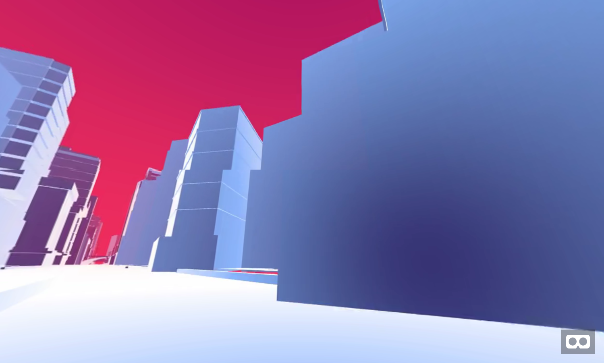
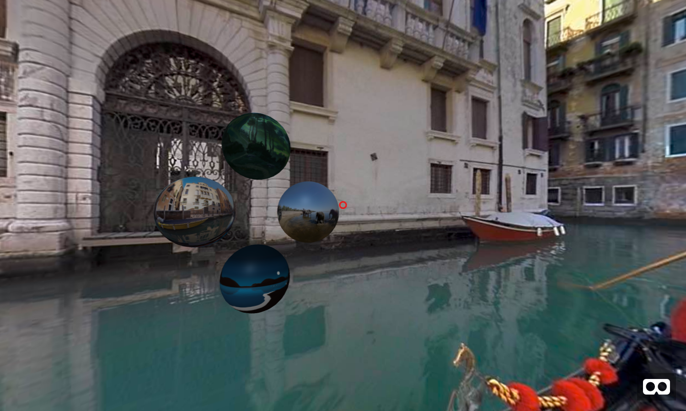
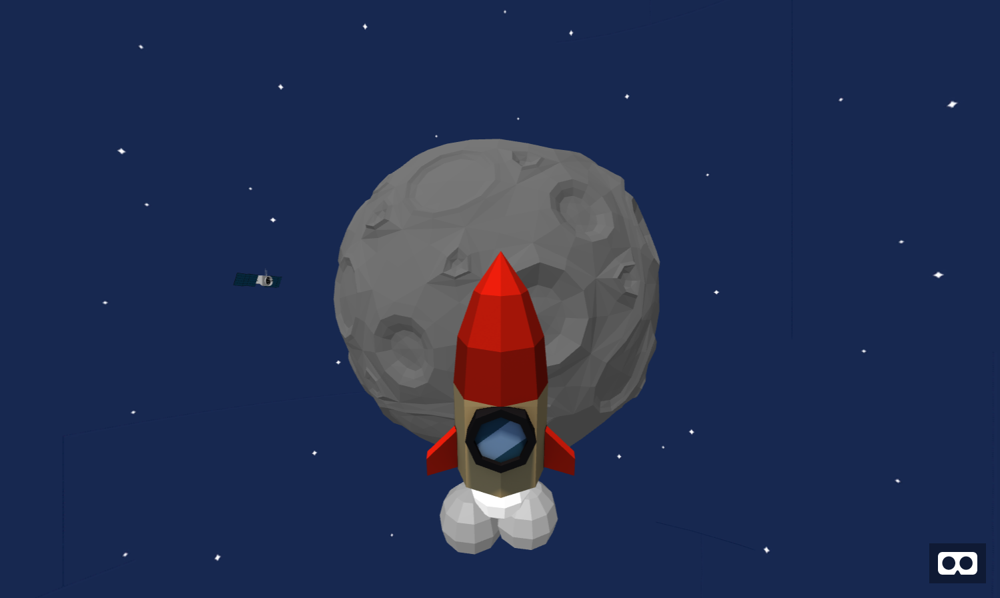
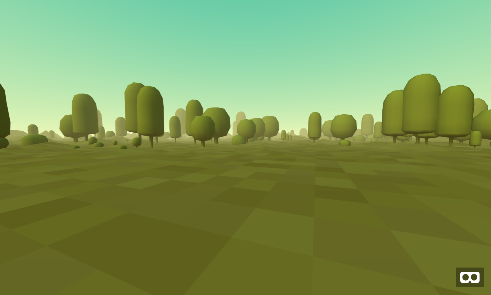
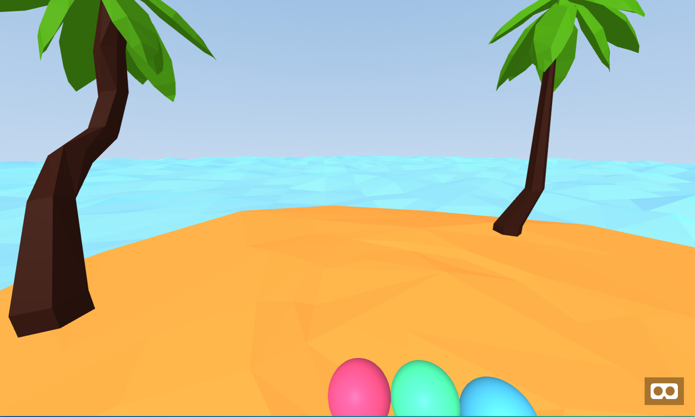

# Virtual Reality and the Web

WebVR is, as it sounds, Virtual Reality on the web! That means you can visit a website in a browser and "enter into it" like any other VR experience. There are lots of differnt ways to experience VR these days. You might have experienced VR on your phone using a "[Cardboard](https://vr.google.com/cardboard/)" viewer, or maybe you've experienced VR before in an installation in a museum or gallery. Or perhaps you've used something like an [Oculus Rift](https://www.oculus.com/rift/) or [HTC Vive](https://www.vive.com/us/product/vive-virtual-reality-system/) attached to a PC, or maybe you've used one of the new "standalone" (as in all-in-one, no PC required) headsets like the [Oculus Go](https://www.oculus.com/go/) or [Lenovo Mirage](https://www.lenovo.com/us/en/virtual-reality-and-smart-devices/virtual-and-augmented-reality/lenovo-mirage-solo/Mirage-Solo/p/ZZIRZRHVR01) (Google Daydream).

There are plenty of ways to experience VR, but if you want to create a VR experience and share it with others you need to get your work into various "app stores." These are software silos, walled gardens controlled by various different gate keeps. If you want to create a VR experience for iPhones you have to get Apple's permission, if you want to make one for Android (Google Daydream or otherwise) you need to get into the Google Play store. The same goes for Oculus and HTC Vive (Steam store). Beyond the obstacles this ads to sharing your work, you also limit your audience to whichever device/store you submit to (unless of course you go through the effort to submit to them all).

The best way around that is to use the Web, the largest, open and decentralized platform on the planet. All the various VR devices mentioned above have access to a browser, which means they have access to the Web. So if you put your work on the Web not only do you get to skip the "middle man" but your work is immediately accessible by anyone with a VR headset (or mobile phone) and access to the Internet. We won't be discussing how to publish on the web in this workshop, but A-Frame has a helpful page on [various ways to get your work online](https://aframe.io/docs/0.9.0/introduction/hosting-and-publishing.html) (and if you need help with that you can always ask me or Tom)

For examples of projects you can try right now made with WebVR check out the [https://webvr.directory/](https://webvr.directory/)

Virtual Reality has been around a long time, years even decades depending on when you [start the clock](https://en.wikipedia.org/wiki/Virtual_reality#History), but VR has never been more accessible than it is today. This is due in part to cheaper consumer hardware from the Oculus Go ($200) to the HTC Vive ($499). Today it's being used in everything from [education](https://www.youtube.com/watch?v=zGGVYT0cMHg), to [physical therapy](https://youtu.be/sDc5lIj1VbY?t=731) and [mental health](https://www.youtube.com/watch?v=GMttQHMjbJo). It's even being used as [evidence in court cases](https://www.youtube.com/watch?v=GiJuPB7S2I4). So it's no surprise that artist's have been experimenting with VR as well. New Media artist Evan Meaney's piece [++ We Will Love You For Ever](https://www.evanmeaney.com/evanmeaney_works_andwewillloveyouforever.html) was recently picked up for distribution by the Video Data Bank on campus (their first VR piece in the collection) and pieces like "[Real Violence](https://www.newyorker.com/culture/cultural-comment/confronting-the-shocking-virtual-reality-artwork-at-the-whitney-biennial)" by Jordan Wolfson have been exhibited in major shows like the Whitney Biennial. For more inspiration check out [Creative Applications](https://www.creativeapplications.net/?s=VR&submit=Search)' list of VR art projects.

As exciting as it all is, I would be remiss if I didn't mention some of the dangers. Like so many other gadgets of our day, there are companies who see VR as yet another way to gather and monetize our data (check out this article on "[eye tracking](https://www.wired.com/story/eye-tracking-vr/ )" in vr). As with all tech, it's important to keep a critical eye on the way VR effects society as it evolves.

# the Workshop

The sections linked below are high-level recaps of all the things we're going to cover in this workshop. I've tried to summarize all of the main points here for reference, but you should not consider this a substitute for your own notes. I recommend taking lots of notes! We'll be using the [A-Frame](https://aframe.io/) library to create WebVR experiences, so after completing this workshop visiting the [A-Frame Docs](https://aframe.io/docs/0.9.0/introduction/) is a great way to continue learning. We'll also be using a few community developed components (additional libraries), to explore other community developed components check out [A-Frame Registry](https://aframe.io/aframe-registry/)

Keep in mind, the idea behind this workshop is to learn to code our own VR experience from scratch but there are plenty of other creative uses for VR, for example lots of artists are starting to create VR "drawings" using VR apps like [Google Tilt Brush](https://www.tiltbrush.com/) or [Mozilla's A-Painter](https://aframe.io/a-painter/) (itself built with A-Frame). You can also use VR apps to create 3D models using apps like [Google Blocks](https://vr.google.com/blocks/) or [Supercraft](https://supermedium.com/supercraft/) which might be a more natural way to model 3D objects than doing it with a mouse on a screen. There are even VR apps for creating frame by frame animations like [Norman](https://www.creativeapplications.net/js/norman-webvr-tool-to-create-frame-by-frame-animations-in-3d/). So while we'll be approaching VR as a medium itself in this workshop, you might also consider VR as a tool for making other kinds of work.

## HTML Code

We're are going to be writing [HTML](https://developer.mozilla.org/en-US/docs/Web/HTML) code or "Hypertext Markup Language." If you're familiar with HTML great! If not, then this workshop will also serve as an introduction to the basic syntax/style of HTML (albeit an unconventional one, as most "intros to HTML" start with basic examples like text and not VR). If it's been a while since you've written HTML here's a quick recap.

HTML is a kind of markup language. we use **html elements** in order to give our html page structure and organize our content. An element usually consists of a pair of **tags**, an opening tag has a `<` followed by characters that specify which tag it is, and then a `>`. the closing tag is the same except with `/` before the characters. Between the opening` <tag>` and the closing `</tag>` is where we place our content.

(*a list of HTML elements can be found [here](https://developer.mozilla.org/en-US/docs/Web/HTML/Element) if you're curious, but we'll be using an entirely different set of elements provided by the A-Frame library*)

Inside the opening tag (between the `<tag` and the `>`) you can include **attributes**. Attributes are used to add extra information about that particular element. The first part of an attribute is the **attribute name**. It indicates what kind of extra information your going to add to that element. These names are specific, always lower case and followed by a `=` the second part of an attribute is the **attribute value**, this is the info or setting for this attribute, different elements can have different values, but they should always follow the `=` and be surrounded in `" "`

## Project Setup

#### You'll need the following software

- **Code Editor**: [Atom](https://atom.io/) (or whichever you prefer)
- **Desktop Browser**: [Firefox](https://www.mozilla.org/en-US/firefox/new/) (or whichever you prefer, though keep in mind, if you have a VR headset attached to your computer, you'll need a [WebVR capable](https://webvr.rocks/) browser)
- **Mobile Browser**: whichever you have on your phone is probably fine.
- **VR Headset Browser**: on standalone VR headsets we'll be using either [Firefox Reality](https://mixedreality.mozilla.org/firefox-reality/) or [Supermedium](https://supermedium.com/)

#### Setting up a project

Every/any code-based project should always be contained in a folder, so the first thing you always need to do is create a folder (aka a "directory"), I called mine "webvr". Open that folder in Atom by either dragging the folder onto the Atom icon, or open Atom and then in the menu click File > Add Project Folder...

Once the folder is open in Atom, right mouse click the folder icon and choose New File, then name it `index.html` this will be our main file and our starting point. A couple of important rules when naming files and folders are:
- **avoid spaces!** While technically you can have spaces in folder/filenames, you want to avoid this because it can cause confusion when writing code. If you really need a space use a `-` or `_` instead
- **keep it all lowercase!** Similarly to avoid confusion when coding and writing filepaths it's best to keep things consistently lowercase (avoid capital letters).

While in Atom, write something like `Hello There!` in your index page. Now open your `index.html` page in Firefox to see the result in the browser. From here on out you'll be making **changes** to your file in Atom, then **saving** those changes, then **refreshing** your browser to see the results.

#### Running a local server

While many of the examples we'll cover can be viewed simply by opening your `index.html` page in a browser directly. Some of the examples reference media assets like images and videos which (because of browser security reasons) can only be requested through a "web server." To run a web server on your computer:

- open a terminal (search for "Terminal" in spotlight)
- then type `cd ` (with a space after it) and then drag and drop the folder you just created for your project into the terminal
- you should see the "path" to your folder appear in the terminal, click enter.
- now that you'r in the folder enter: `python -m SimpleHTTPServer` (if that doesn't work try `python -m http.server`)
- once the server is running open a browser and visit [http://localhost:8000](http://localhost:8000) and you should see your index page.

With that we're ready to start coding some VR! Jump to the [Intro Notes](intro) to get started.

## Workshop Sections

Time permitting, we'll be covering the following concepts in A-Frame:

#### [Basic Introduction](https://github.com/nbriz/webvr-workshop/tree/master/intro) to the library and how it works.

#### [360 Video](https://github.com/nbriz/webvr-workshop/tree/master/360video) and managing media assets

#### Controller and Gaze based [Interactions](https://github.com/nbriz/webvr-workshop/tree/master/interaction)

#### [Importing Models](https://github.com/nbriz/webvr-workshop/tree/master/importing-models), like OBJ and GLTF files.

#### [Animation](https://github.com/nbriz/webvr-workshop/tree/master/animation)

#### [Teleporting](https://github.com/nbriz/webvr-workshop/tree/master/teleporting) (a common mechanic in VR)

#### [Basic Physics](https://github.com/nbriz/webvr-workshop/tree/master/physics) (common in games)

