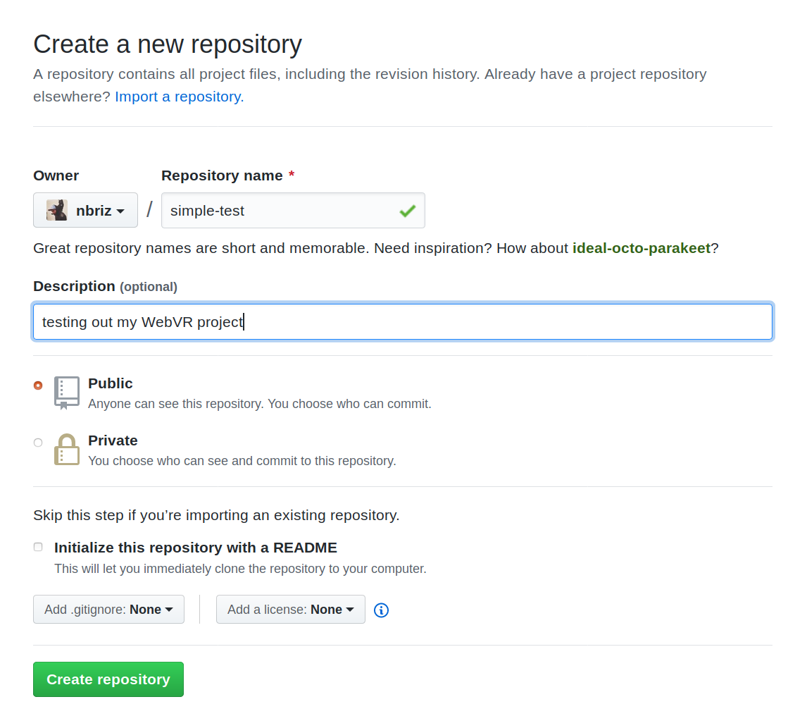
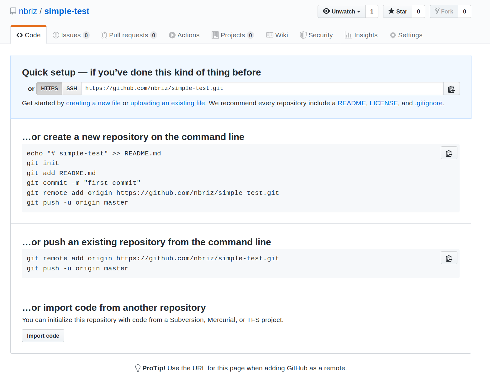
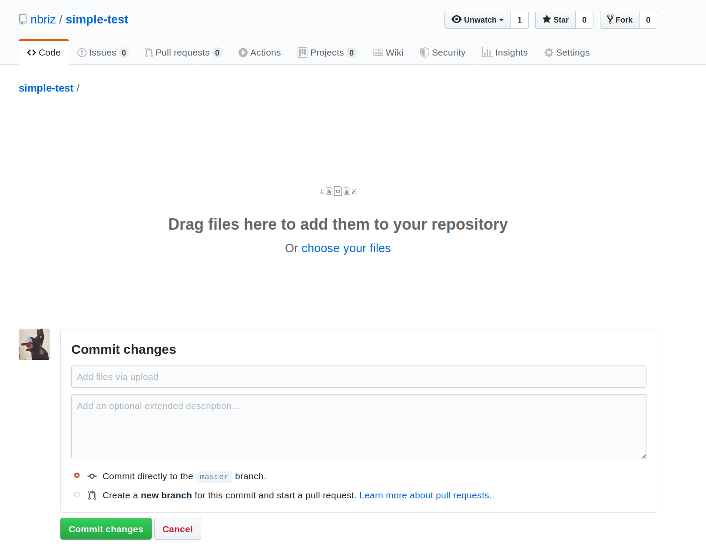
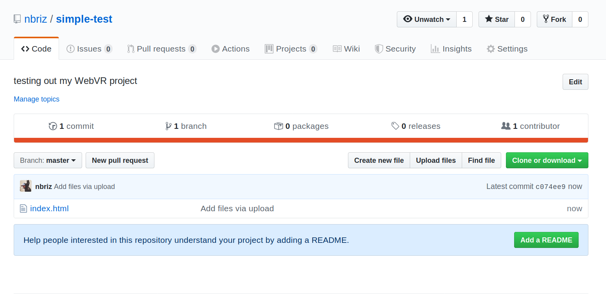
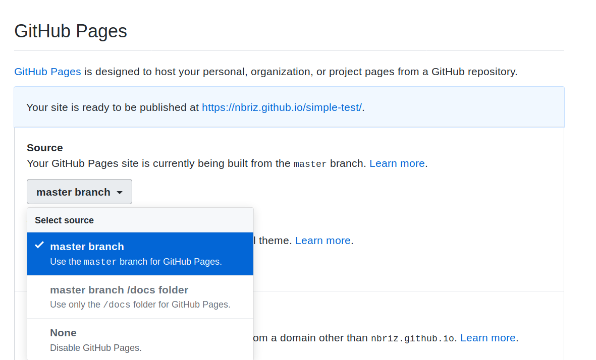

# Using GitHub to host your WebVR project

These are step by step instructions for hosing a WebVR project on GitHub. This means GitHub will be our server so that our WebVR project can be acessible to anyone on the Internet (instead of just other computers in our local network as is the case when we run our local servers). This is not limited to a WebVR project, any web site or web app can be hosted on GitHub this way, assuming it is a "static" project (meaning it does not require any fancy server side logic or rendering, which our WebVR projects do not).

# Step 0: before we begin

These instructions assume you've already got a web project (which means a folder with at the very least one file in it called `index.html`). In my case I have a folder called 'simple-test' and in there I have a very simple `index.html` file which looks like this:
```html
<script src="https://aframe.io/releases/0.9.0/aframe.min.js"></script>
<a-scene background="color: #ffff00;">

  <a-entity id="ball"
    geometry="primitive: sphere; radius: 0.5"
    material="color: #ff00ff;"
    position="-1 1.75 -2"></a-entity>

  <a-entity id="box"
    geometry="primitive: box;"
    material="color: #00ffff;"
    position="1 1.75 -2"></a-entity>

</a-scene>
```

# Step 1: create a new GitHub project

If you haven't already, create a free account on [github](https://github.com/). Once you're signed in, create a new project (aka "repository") by click on the green "New" or "New Repository" button or simply go to [https://github.com/new](https://github.com/new). Once there you should see a page like this:



To keep things organized name your repository the same name you gave your project folder on your computer. You can write anything for the description (that's optional). Keep the other settings as they are by default and click on the green "Create repository" button.

# Step 2: upload your file(s)

Once you click the "Create repository" button, you will be redirected to a page that looks like this:



In the light blue "Quick setup..." box you should see a link that says "uploading an existing file", click on this. You will be taken to another page where you have the option to drag and drop your files (or click the "choose your files" link to upload your files).



You should upload your entire project, meaning all of the files that are inside youre project folder on your computer (in my case that's just the single `index.html` file mentioned above). Once uploaded, click on the green "Commit changes" button. You should then be redirected to your new project (aka repository) page, which should look something like this:



**NOTE:** you can click on the "Upload files" button at any time to upload more files or update existing files when you've made changes to them on your computer.

# Step 3: enable hosting (ie. GitHub Pages)

Now that your files are on GitHub we just need to let GitHub know we want them to be served by their static server. On GitHub their free static hosting service is called "GitHub Pages". You can find it by clicking on the "Settings" tab on your project page and then scrolling down to where it says "GitHub Pages", then where it says "Source" click the drop-down menu and choose "master branch" (see image below for reference).



Once clicked, you should see a message appear in a blue box that says "Your site is ready to be published at https://username.github.com/project-name" (except with your username and project name in it). Click on that link to see your website! Share that link with anyone in the world so they can see it. Remember a VR project like this can be visited by any browser, be it on a laptop, smart phone, VR headset, etc!

**NOTE:** it might take a couple of minutes before the website is up. Also if you upload new files or changes to your project in the future, it will also take a few minutes for the server to register those changes. If you don't see what you're expecting, wait a few minutes then check the link again.
