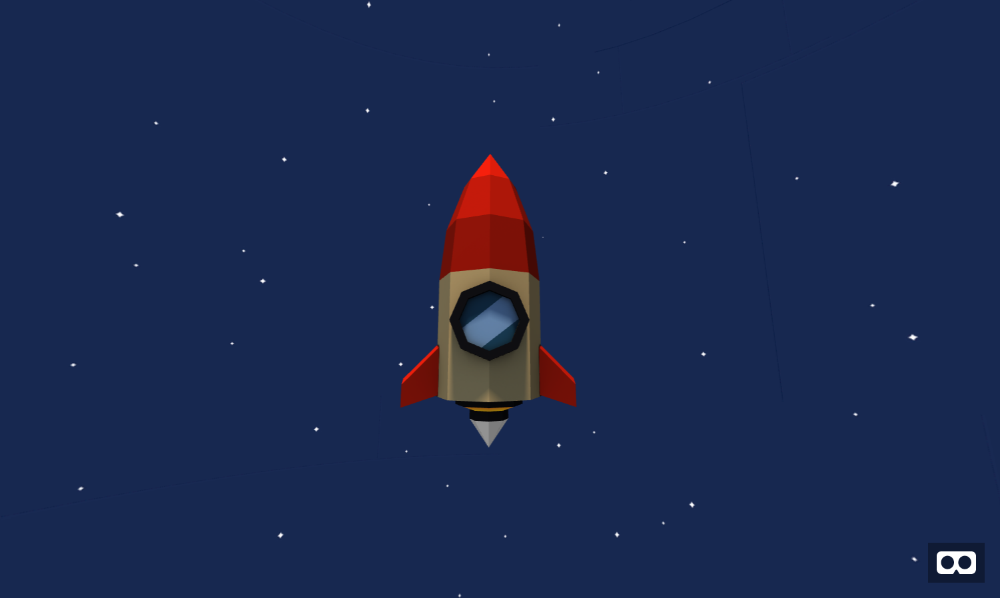

# Importing Models

There are lots of different 3D model filetypes out there, and while it's technically possible to load up pretty much anything into a browser, we'll stick to OBJ and GLTF files because those are the types for which [A-Frame has built-in support](https://aframe.io/docs/0.9.0/introduction/models.html).

You can create your own models with programs like Maya or Blender, or you could also download free models from sites like:

- [Google Poly](https://poly.google.com/)
- [3D Wherehouse](https://3dwarehouse.sketchup.com/)
- [Thingiverse](https://www.thingiverse.com/)
- [Turbosquid](https://www.turbosquid.com/Search/3D-Models/free)
- [Archive3D](https://archive3d.net/)
- [Clara](https://clara.io/)

Keep in mind, if you download a format other than OBJ or GLTF you'll need to first convert it to either of those using something like Maya or Blender before it will work in A-Frame.


## Using OBJ


Let's start with an OBJ file as it's likely the most common of 3D file formats. Create a folder called "models" in your project and another inside of that called "obj", then download the OBJ files for [happy town](https://poly.google.com/view/baRmeivEYFz). Then unzip the files and place them all in a folder called "town" inside of your obj folder. Once in there we can include it as an asset using our asset manager like this:

```html
<a-scene>

  <a-assets>
    <a-asset-item id="town-obj" src="models/obj/town/Final.obj"></a-asset-item>
    <a-asset-item id="town-mtl" src="models/obj/town/Final.mtl"></a-asset-item>
  </a-assets>

</a-scene>
```

Once you've got the OBJ (which handles the geometry) and MTL (the material) of our rocket loaded into our asset manager we can create an entity for it like this:

```html
<a-entity obj-model="obj: #town-obj; mtl: #town-mtl"></a-entity>
```

You might notice things don't look great by default, we'll want to reposition and scale things so that it looks better. Let's give our entity an **id** and add a few attributes/components **position**, **rotation** and **scale** and then use the A-Frame [Visual Inpsector](https://aframe.io/docs/0.9.0/introduction/visual-inspector-and-dev-tools.html) (Ctrl + Alt + I) to find a position/scale/rotation that works for you.


```html
<a-entity id="happy-town"
  obj-model="obj: #town-obj; mtl: #town-mtl"
  position="0 0 0"
  rotation="0 0 0"
  scale="1 1 1"></a-entity>
```

## Lights

As I mentioned in the Intro notes, A-Frame automatically adds 2 lights and a camera entity for you. One of the two lights is a "directional light" which creates a really harsh glare on parts of our model. If you define your own lights in the scene it will override these default lights. There are lots of different [types of lights](https://aframe.io/docs/0.9.0/components/light.html) in A-Frame, let's start with the most basic, ambient:

```html
<a-entity light="type: ambient; color: #BBB"></a-entity>
```

At this point are scene is likely looking a little too dark with just the ambient light. So let's add another light, but rather than adding a directional or spotlight which will add those harsh glares, let's use a hemisphere light to give our scene a flat cartoony finish.

```html
<a-entity light="type: hemisphere; color: #7878db; groundColor: #129f12; intensity: 1.2"></a-entity>
```

You can also use the Visual Inspector to adjust (and copy+paste) the properties of your light entities.

If we were going to share this project on the Internet it's be important to credit the author of the original model (as per the Creative Commons license specified on the site). Check out [obj-example/index.html](obj-example/index.html) to see the final result.

## Using GLTF



Though OBJ files might be more common, GLTF files work better on the web with A-Frame, so for the rest of our examples we'll be downloaded GLTF file types. It's pretty similar to the OBJ example, except that we only need to reference a single file. We'll start by downloaded a model like this [rocket](https://poly.google.com/view/8iKIYCyvh2k) (making sure to choose the GLTF download option). Next we'll unzip the downloaded files and save it to `models/gltf/rocket/`

```html
<a-scene>

  <a-assets>
    <a-asset-item id="rocket-gltf" src="models/gltf/rocket/PUSHILIN_rocket_ship.gltf"></a-asset-item>
  </a-assets>

  <a-entity id="rocket" gltf-model="#rocket-gltf"></a-entity>

</a-scene>
```

Check out [gltf-exmaple/index.html](ltf-exmaple/index.html) for the finished example
