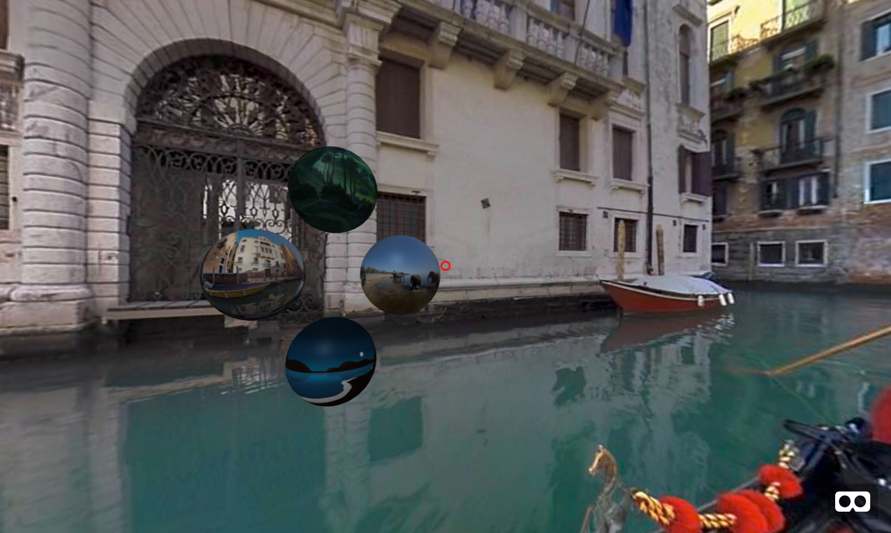

# Interaction



In this next example we'll construct a scene with 4 spheres, each will be textured with a different 360 image. These spheres will serve as "buttons" or "triggers" to change our `<a-sky>` to a different 360 image. Let's create 4 spheres each with a different image, but rather than specifying the path directly in the **material** attribute/component like we did before, this time we'll use the asset management system to keep things a bit more efficient.

Start by downloading the following images into your images folder and then copy+paste the code below into your `index.html` page:
- [beach.jpg](https://raw.githubusercontent.com/nbriz/webvr-workshop/master/interaction/360image-gallery-gaze/images/beach.jpg)
- [elephant.jpg](https://raw.githubusercontent.com/nbriz/webvr-workshop/master/interaction/360image-gallery-gaze/images/elephant.jpg)
- [mountain.jpg](https://raw.githubusercontent.com/nbriz/webvr-workshop/master/interaction/360image-gallery-gaze/images/mountain.jpg)
- [space.jpg](https://raw.githubusercontent.com/nbriz/webvr-workshop/master/interaction/360image-gallery-gaze/images/space.jpg)
- [venice.jpg](https://raw.githubusercontent.com/nbriz/webvr-workshop/master/interaction/360image-gallery-gaze/images/venice.jpg)

```HTML
<a-scene>

  <a-assets>
    
    
    
    
    
  </a-assets>

  <a-sky id="bg" src="#space"></a-sky>

  <a-entity id="sel1" class="sphere"
    geometry="primitive: sphere; radius: 0.25;"
    material="src: #beach; color: grey;"
    position="0 1.25 -2"></a-entity>

  <a-entity id="sel2" class="sphere"
    geometry="primitive: sphere; radius: 0.25;"
    material="src: #mountain; color: grey;"
    position="0 2.25 -2"></a-entity>

  <a-entity id="sel3" class="sphere"
    geometry="primitive: sphere; radius: 0.25;"
    material="src: #venice; color: grey;"
    position="-0.4 1.75 -2"></a-entity>

  <a-entity id="sel4" class="sphere"
    geometry="primitive: sphere; radius: 0.25;"
    material="src: #elephant; color: grey;"
    position="0.4 1.75 -2"></a-entity>

</a-scene>
```

In web programming, user interactions like "clicks" or "scrolling" are called "events." In order to create and trigger events in A-Frame we need to use a community developed component called [Event Set](https://github.com/amitwaghmare/aframe-event-set-component) so you'll need to add this line of code just under the line that imports the A-Frame library:

```HTML
<script src="https://unpkg.com/aframe-event-set-component@4.2.1/dist/aframe-event-set-component.min.js"></script>
```

You might have noticed that each of our sphere entity's has a new attribute called **class** assigned to it with the value of "sphere", this will be used by our event system to know which objects in our scene to interact with and which to ignore.

## Gaze Interaction

In order to interact with objects using our "gaze" we'll need to override the default camera entity A-Frame makes by default and define our own like this:

```HTML
<a-entity camera look-controls position="0 1.75 0"></a-entity>
```

If everything seems the same then it worked right. A-Frame has a special `<a-cursor>` element we can use to create a gaze based cursor object. To make sure the cursor follows our gaze we'll need to create this element between the opening and closing tags of our camera entity like this:

```HTML
<a-entity camera look-controls position="0 1.75 0">
  <a-cursor color="red"></a-cursor>
</a-entity>
```

Next let's create some "events", we first need to specify which objects in the scene we want our cursor to interact with by adding **raycaster** component to the cursor element which specifies the class name of the objects (which in our case we called "sphere"). Similarly to how we reference "id" with the `#` symbol, a "class" is referenced with the `.` symbol.

```HTML
<a-entity camera look-controls position="0 1.75 0">
  <a-cursor color="red" raycaster="objects: .sphere"></a-cursor>
</a-entity>
```

Now we can specify our events. We do this by adding the **event-set** attribute/component. If we want to define more than one event we need to append the component name with **__something** where "something" is whatever you want (so long as it's different from the others). Then as the event value we pick the type of event we want to define like `_event: mouseenter;` and what we want to change about our cursor when that happens, for example `color: springgreen`. Check out the A-Frame docs for a full list of [cursor events](https://aframe.io/docs/0.9.0/components/cursor.html#events).

```html
<a-entity camera look-controls position="0 1.75 0">
  <a-cursor color="red"
    event-set__1="_event: mouseenter; color: springgreen"
    event-set__2="_event: mouseleave; color: red"
    raycaster="objects: .sphere"></a-cursor>
</a-entity>
```

You should now see the cursor color change to "springgreen" when it's "over" any of the objects with the 'sphere' class (which is to say, any of our sphere elements) and when the cursor "leaves" or hovers off of a sphere the color should return to "red".

Next let's add events to our spheres, so that when the cursor hovers over it it's color changes to 'white' and when the cursor leaves it then it changes the color back to 'grey', this will create a kind of **selection** effect (Similar to when we hover over links on a webpage).

Then we'll add one more event to change the sky's 360 Image when we hover over it. This event will be a little different, because rather than changing something about the entity itself (the sphere) this will trigger a change in a separate element (the sky). In order to trigger changes in other elements we must specify a target by adding the following property to the **event-set** value ` _target: #bg;` and then we specify which property of that element we want to change. In our case we are targetting the `<a-sky id="bg" src="#space">` element and we want to change it's "src" attribute to match the src of this particular sphere, which in the case below is `#beach`

```HTML
<a-entity id="sel1" class="sphere"
  geometry="primitive: sphere; radius: 0.25;"
  material="src: #beach; color: grey;"
  event-set__1="_event: mouseenter; material.color: white;"
  event-set__2="_event: mouseleave; material.color: grey;"
  event-set__3="_event: mouseenter; _target: #bg; src: #beach"
  position="0 1.25 -2"></a-entity>
```

Apply that same logic to the other spheres and you've got yourself a 360 Image gallery! To see the final result check out [360image-gallery-gaze/index.html](360image-gallery-gaze/index.html)

## Controller Interaction

If we have a VR headset that also has a controller, we can choose to interact and trigger events with that instead of through our gaze. There are lots of different controllers out there because there are lots of different VR headsets out there, fortunately A-Frame makes it pretty easy to work with most of the popular ones. There are a few [different ways to introduce controllers](https://aframe.io/docs/0.9.0/introduction/interactions-and-controllers.html) into your scene in A-Frame, but we'll be using the [laser-controls](https://aframe.io/docs/0.9.0/components/laser-controls.html#sidebar) for this example. Replace your camera entity with the following:

```HTML
<a-entity id="controller"
  laser-controls
  line="color: red"
  event-set__1="_event: mouseenter; line.color: springgreen"
  event-set__2="_event: mouseleave; line.color: red"
  raycaster="objects: .sphere"></a-entity>
```

Notice that this is pretty similar to how we had our gaze controls setup, but there are a few differences. Rather than having 2 entities (one for our camera and another for the cursor inside of our camera) we now just have a single entity for our controller. We've got the **laser-controls** attribute/component defined (this is what creates a laser pointer as well as the appropriate controller object) and we've got a **line** attribute/component to change the color of our laser pointer. The two events that follow as well as the raycaster component are nearly identical to before except that rather than changing the cursors `material.color` we are now changing our controller's `line.color`.

Another improvement we can make to our scene, is rather than changing the sky's 360 image when we hover over each sphere, we can change it when we click our controller. Let's modify the 3rd event of each sphere to look something like this: `event-set__3="_event: click; _target: #bg; src: #beach"` where the event is now "click" instead of "mouseenter".

To see the finished version check out [360image-gallery-click/index.html](360image-gallery-click/index.html)
