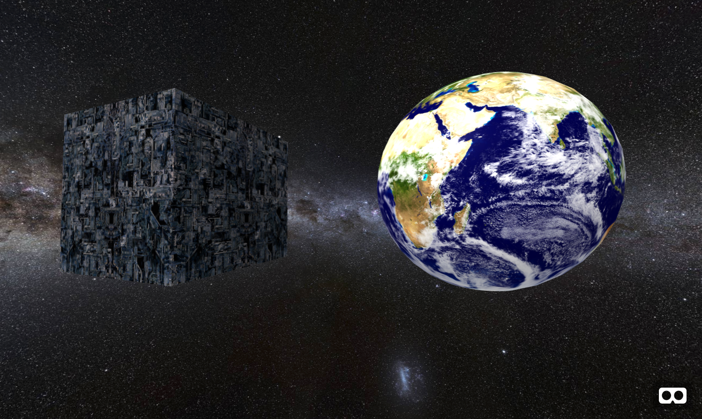

# Introduction



Before we can write any A-Frame code in our `index.html` file of our project, we need to include the A-Frame library in our page:

```html
<script src="https://aframe.io/releases/0.9.0/aframe.min.js"></script>
```

## Creating a Scene

Once you've got the library imported, the next thing we always need to include when creating a WebVR project is a "scene", in A-Frame we create a scene by adding the following code:
```html
<a-scene>
  <!-- all our other code will go between the opening and closeing a-scene tags -->
</a-scene>
```

## Creating Objects

Next we'll create a sphere. In 3D programming, objects are often called "meshes", a mesh can be defined as some sort of shape or **geometry** in combination with some kind of color or texture or **material**, to create a mesh in A-frame we'll use the `<a-entity>` element as well as the geometry and material attributes (aka "components" in A-Frame lingo).

```html
<a-scene>

  <a-entity geometry="primitive: sphere;" material="color: blue;"></a-entity>

</a-scene>
```

If we view our scene in the browser at this point we won't see anything, this is because our sphere is not in view of the "camera", we either need to move the camera or move the sphere, let's do the latter by adding a **position** attribute/component to our entity. Let's also give it a name using the **id** attribute:

```html
<a-scene>

  <a-entity id="ball"
    geometry="primitive: sphere;"
    material="color: blue;"
    position="0 1.75 -2"></a-entity>

</a-scene>
```

Now let's create a cube using the 'box' by copy+pasting our sphere and changing the primitive shape to 'box' and the color to 'red' (let's also give it a different 'id'). I've also gone ahead and given our scene a background color.

```html
<a-scene background="color: pink;">

  <a-entity id="ball"
    geometry="primitive: sphere;"
    material="color: blue;"
    position="0 1.75 -2"></a-entity>

  <a-entity id="box"
    geometry="primitive: box;"
    material="color: red;"
    position="0 1.75 -2"></a-entity>

</a-scene>
```

## Inspecting Our Scene

If you save your page and refresh your browser window you won't see the red box, this is because it's inside of the ball. Let's use the A-Frame [Visual Inpsector](https://aframe.io/docs/0.9.0/introduction/visual-inspector-and-dev-tools.html) to more easily adjust our mesh positions. Press **Ctrl + Alt + I** to open the Inspector.

On the left you'll notice that there are 5 entities currently in the scene, the two that you've placed as well as a camera and two lights which A-Frame adds by default. Let's click on the box entity to open up it's properties on the right panel.

Here we can make edits to our entity's properties, but keep in mind these edits are only temporary, they're not actually changing your code. For that, we'll have to use the copy button on the top right hand corner and then paste the edited code back into our `index.html` file.

**NOTE:** this copy function doesn't always work perfectly, make sure to inspect the code you've pasted into your index page carefully before saving it.


## 360 Images

To create a 360 Image we essentially need to make a giant sphere that wraps around us with an image textured along the inside walls. A-Frame provides a special element for doing this called `<a-sky>` using the **src** attribute you can assign an image by specifying a file path to that image. Let's download this [panorama of the Milky Way](https://raw.githubusercontent.com/nbriz/webvr-workshop/master/intro/images/space.jpg) and save it as "space.jpg" into into a new folder within our project called "images." Because our index page is in the same folder as the images directory our src path will look like this:

```html
  <a-sky src="images/space.jpg"></a-sky>
```

You can apply images as textures to shapes by adjusting the material attribute/component like this `material="src: images/earth.jpg"`. Try applying this [borg texture](https://raw.githubusercontent.com/nbriz/webvr-workshop/master/intro/images/borg.jpg) to the cube and this [earth texture](https://raw.githubusercontent.com/nbriz/webvr-workshop/master/intro/images/earth.jpg) to the sphere.

## The Finished Example

To see a complete example check out the [index.html](index.html) file in this repo. One thing you'll notice is that we've got a bit more HTML code in this one. That's because a proper HTML page has the following structure

```HTML
<!DOCTYPE html>
<html>
  <head>

    <!-- meta info like the title and author of the page goes here -->
    <!-- links to any libraries or plugins also goes here -->

  </head>
  <body>

    <!-- our scene and all other A-Frame code we write goes in here -->

  </body>
</html>

```
